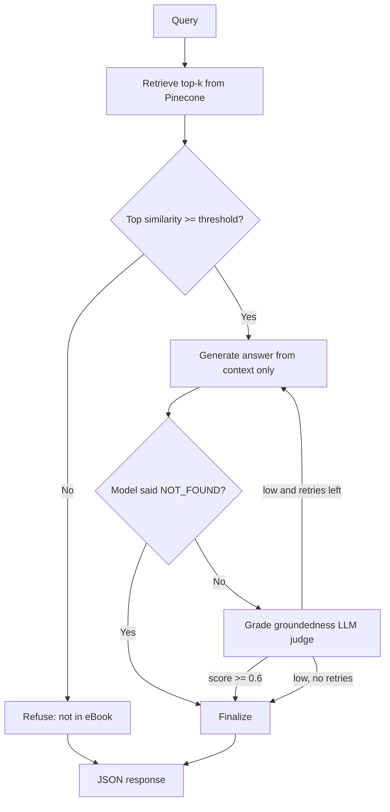

# Agentic AI eBook RAG Chatbot (LangGraph + Pinecone)

A Retrieval-Augmented Generation chatbot that answers questions **strictly from the Agentic AI eBook**.
Built with a custom Python implementation: LangGraph for orchestration, OpenAI embeddings, Pinecone as the vector DB, and FastAPI (plus an optional Streamlit UI).

## Features
- PDF ingestion with page-aware chunking (800 chars, 100 overlap) and metadata (text, page, source)
- Cyclic LangGraph workflow: retrieve → relevance gate → generate → hallucination grade → (retry) → finalize
- Refuses out-of-scope questions (e.g. "What is the capital of France?")
- Structured JSON output with a confidence score

## Architecture



| Stage | File | What it does |
|---|---|---|
| Ingestion | `ingest.py` | Loads PDF (PyPDF), splits (RecursiveCharacterTextSplitter), embeds (OpenAI), upserts to Pinecone |
| Orchestration | `rag_graph.py` | LangGraph state graph with nodes `retrieve`, `generate`, `grade`, `refuse`, `finalize` |
| API | `api.py` | FastAPI `POST /query` |
| UI (optional) | `streamlit_app.py` | Simple Streamlit front end |
| Validation | `scripts/run_sample_queries.py` | Runs the 6 assignment queries |

### How hallucinations are prevented (3 layers)
1. **Retrieval gate**: if the best chunk's cosine similarity is below `MIN_RETRIEVAL_SCORE`, the bot refuses without calling the LLM.
2. **Strict prompt**: the LLM may only use the retrieved context and must output a fixed "not found" sentence otherwise.
3. **Groundedness grader**: a second LLM call scores how many claims in the answer are supported by the context. Low scores trigger a regeneration with feedback (the graph cycle); if it still fails, the bot refuses.

### Confidence score
`confidence = 0.7 × groundedness_score + 0.3 × retrieval_strength`, where retrieval strength is the top cosine similarity normalised (0.6 ≈ 1.0). Refusals return `0.0`.

## Setup

```bash
git clone <your-repo-url>
cd agentic-rag-chatbot
python -m venv venv && source venv/bin/activate   # Windows: venv\Scripts\activate
pip install -r requirements.txt
cp .env.example .env                               # then fill in your keys
```

1. Put the eBook at `data/Ebook-Agentic-AI.pdf` (or use `--url` below).
2. Ingest:
   ```bash
   python ingest.py --pdf data/Ebook-Agentic-AI.pdf
   # or: python ingest.py --url <direct-pdf-url>
   ```
   Add `--reset` to wipe and re-index.

## Run

**API**
```bash
uvicorn api:app --reload
```
```bash
curl -X POST http://127.0.0.1:8000/query \
  -H "Content-Type: application/json" \
  -d '{"query": "What is Agentic AI?"}'
```
Interactive docs: http://127.0.0.1:8000/docs

**Streamlit UI**
```bash
streamlit run streamlit_app.py
```

**Validate with the sample queries**
```bash
python scripts/run_sample_queries.py     # writes sample_outputs.json
```

## Response format
```json
{
  "query": "What is Agentic AI?",
  "final_answer": "...",
  "retrieved_context_chunks": ["Chunk 1 text...", "Chunk 2 text..."],
  "confidence_score": 0.92
}
```

## Configuration
All in `config.py` / `.env`: chunk size, overlap, `TOP_K`, `MIN_RETRIEVAL_SCORE`, models, grader thresholds.
If valid questions get refused, lower `MIN_RETRIEVAL_SCORE`; if off-topic ones slip through, raise it.

## Project structure
```
agentic-rag-chatbot/
├── api.py
├── config.py
├── ingest.py
├── rag_graph.py
├── streamlit_app.py
├── scripts/run_sample_queries.py
├── data/            # place the eBook PDF here
├── sample_outputs.json
├── requirements.txt
├── .env.example
└── README.md
```
